# Building a Multi-Level BOM in ERPNext with Multilevel BOM Creator

If you create products with multiple sub-assemblies, standard BOM creation can become repetitive very quickly. You create BOMs for child assemblies first, then BOMs for their parent assemblies level by level, and you keep switching context just to understand the full structure.

ERPNext also has BOM Creator, but it does not support operations and reuse of existing BOMs inside the same BOM creation tree.

`Multilevel BOM Creator` is meant to solve that. It lets you build the complete structure in one place, include operations in the same tree, reuse existing BOMs where needed, review quantities and cost impact, and then create the required BOMs from the same document.

This post uses a simple `Office Chair` example to show the flow.

## Business Scenario: Office Chair

We will build a BOM for `OFFICE-CHAIR` with quantity `1 Nos`.

The chair will have these direct children:

- `CHAIR-BASE` qty `1`
- `GAS-LIFT` qty `1`
- `ARMREST` qty `2`
- `WHEEL-ASSEMBLY` qty `4`
- `SEAT-ASSEMBLY` qty `1`
- `BACKREST-ASSEMBLY` qty `1`

Inside `WHEEL-ASSEMBLY`, we will add:

- `WHEEL` qty `1`
- `AXLE-PIN` qty `1`
- `BOLT` qty `4`

Inside `SEAT-ASSEMBLY`, we will add:

- `SEAT-CUSHION` qty `1`
- `SEAT-BOARD` qty `1`
- `UPHOLSTERY-FABRIC` qty `2`
- operation `Seat Upholstery`

For `BACKREST-ASSEMBLY`, we will reuse an already existing BOM.

That gives us a good mix of:

- direct child items
- new sub-assemblies
- an existing sub-assembly
- operations at different levels
- quantity and cost multiplication inside the tree

For this example, assume that all required items, operations, workstations, and the existing BOM for `BACKREST-ASSEMBLY` are already present in ERPNext.

## 1. Create the Document and Enter Final (Root) Product Details

Start a new `Multilevel BOM Creator` and enter the basic context for the product you want to build. In this example, that means selecting `OFFICE-CHAIR`, setting the company, quantity, and currency.

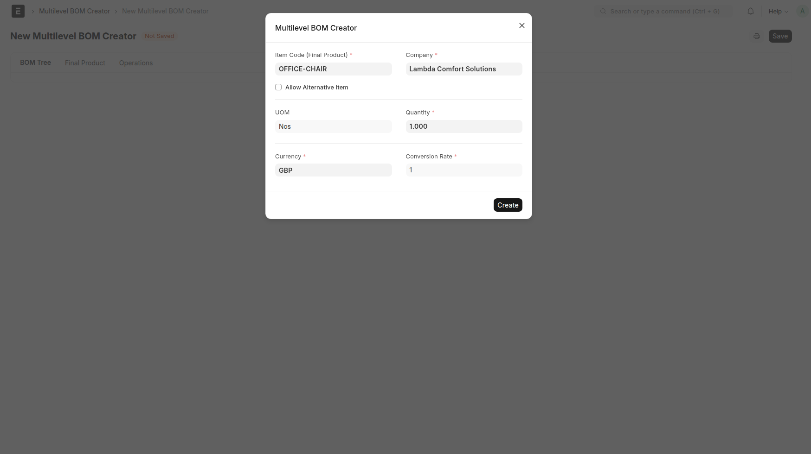
*Caption: Create the document and enter the finished product details.*

## 2. Add Direct Child Items

The first action most users will take is `Add Item`. In this example, we use it first for `ARMREST` with quantity `2`.

Open the row menu on the root item and choose `Add Item`.

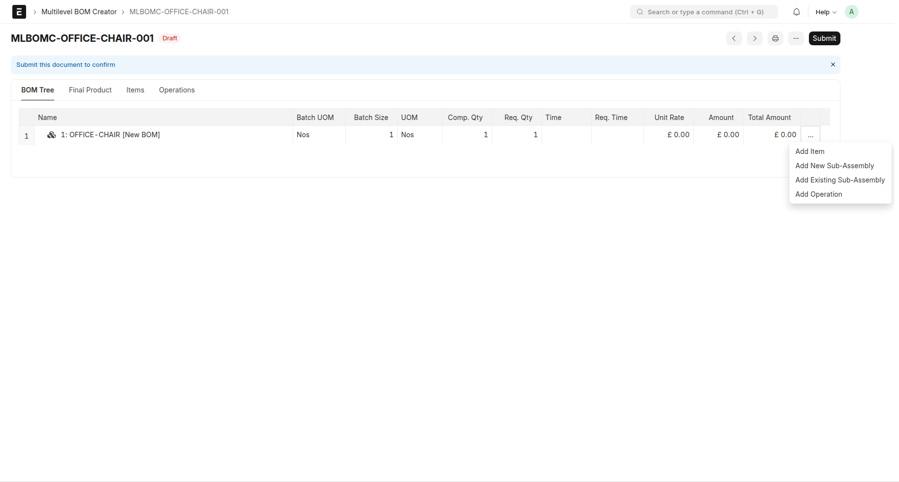
*Caption: Start from the row action menu on the root item and choose `Add Item`.*

Fill the dialog with the item details and quantity required for one chair.

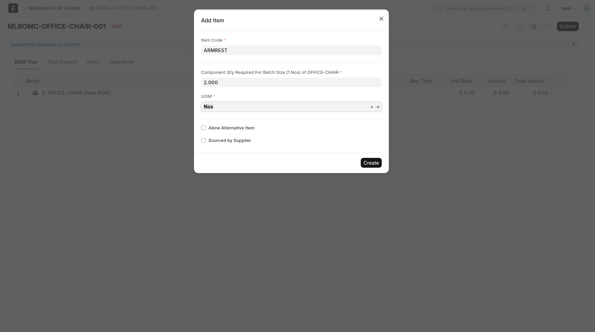
*Caption: Enter the first direct child item details in the `Add Item` dialog.*

Once saved, the item appears directly under the finished (root) product. You can also immediately see updated quantity and cost information in the new row as well as in the parent row.

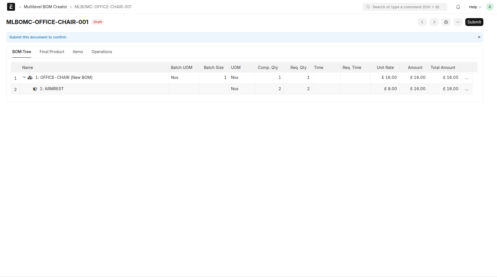
*Caption: The first direct child item now appears under the final product.*

After that, the remaining direct child items can be added the same way. In this example, we complete the root-level items by adding `CHAIR-BASE` and `GAS-LIFT`.

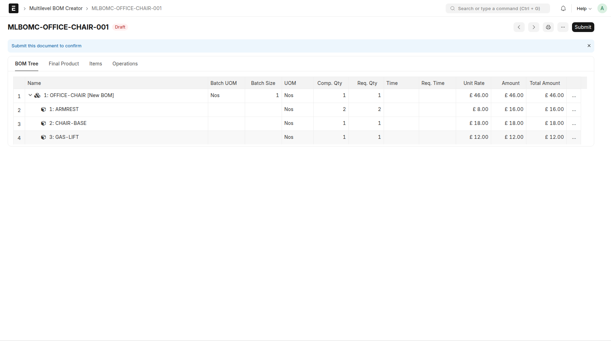
*Caption: Add the remaining direct child items under the final product.*

## 3. Add a New Sub-Assembly

The next useful action is `Add New Sub-Assembly`. We will use it for `WHEEL-ASSEMBLY`.

This is the right option when the child assembly does not yet have its own BOM and you want the system to create it from the current document.

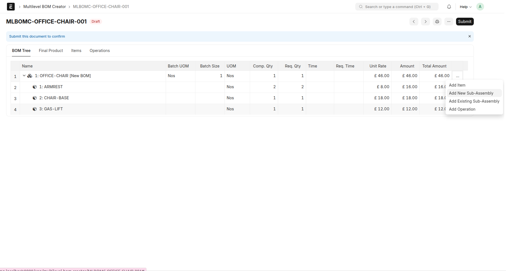
*Caption: Choose `Add New Sub-Assembly` from the root item menu.*

In the dialog, enter the sub-assembly item, quantity required under the parent, and the batch size for the sub-assembly itself.

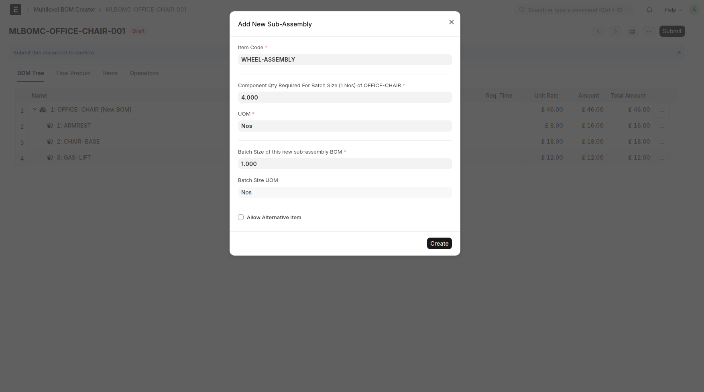
*Caption: Enter the new sub-assembly details for `WHEEL-ASSEMBLY`.*

After saving, the new sub-assembly becomes part of the tree and you can start building its internal structure.

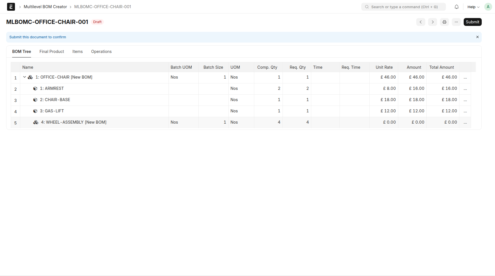
*Caption: The new sub-assembly is now part of the BOM tree.*

For this example, `WHEEL-ASSEMBLY` is completed with `WHEEL`, `AXLE-PIN`, and `BOLT`.

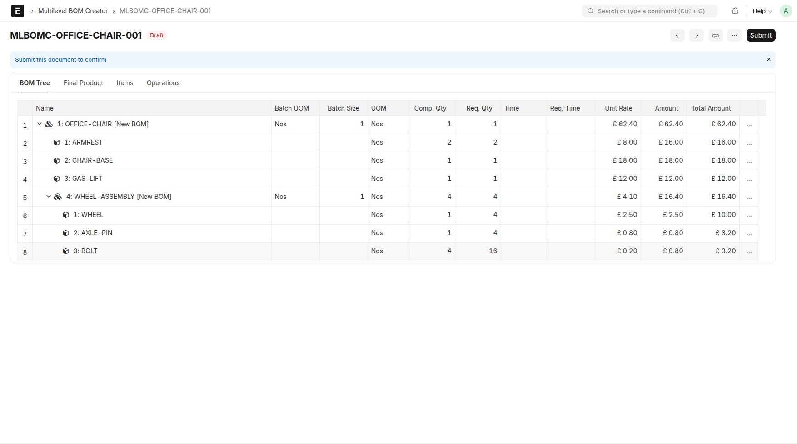
*Caption: Complete `WHEEL-ASSEMBLY` by adding `WHEEL`, `AXLE-PIN`, and `BOLT`.*

This part of the example shows one of the most useful things about the tool. The chair needs `4` `WHEEL-ASSEMBLY`, and each wheel assembly needs `4` `BOLT`. That means the tree can show the total required quantity of `BOLT` across the full product structure instead of making the user calculate it separately.

## 4. Add an Existing Sub-Assembly

Now consider the opposite case: the assembly already exists and you only want to reuse it. For that, use `Add Existing Sub-Assembly`.

In this example, `BACKREST-ASSEMBLY` is already defined as a submitted BOM, so we can pull it into the new chair structure.

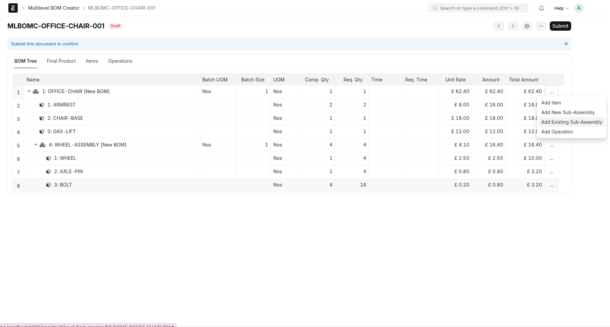
*Caption: Choose `Add Existing Sub-Assembly` when the BOM already exists in ERPNext.*

Select the BOM in the dialog and save it into the tree.

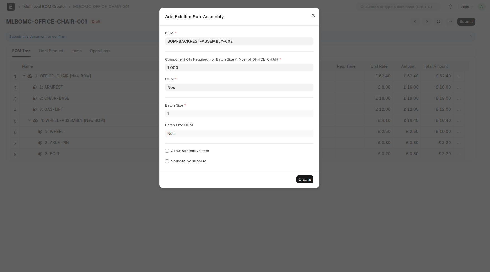
*Caption: Select the existing BOM to reuse in the current structure.*

Once added, the existing BOM is expanded fully in the tree so the user can also understand its structure in the same view. Its child nodes appear as projected rows and remain read-only because they represent an already existing BOM.

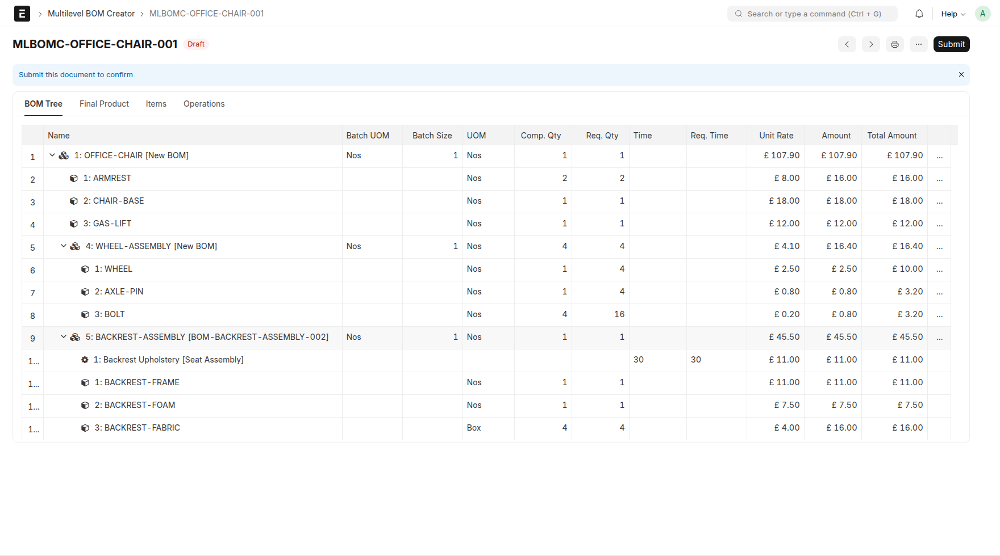
*Caption: Existing BOMs appear with projected read-only structure.*

That is an important detail. Projected rows are there to give visibility into the referenced structure, but they are not editable directly from this tree.

## 5. Add Operations

Operations can be added exactly where the work is performed. In this example, we show the action once and then complete the remaining operations in the structure.

Here the first example is `Seat Upholstery` under `SEAT-ASSEMBLY`.

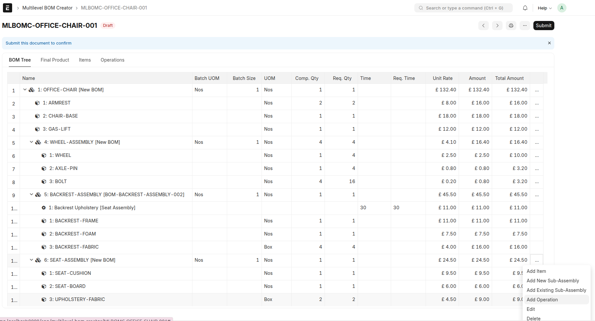
*Caption: Use `Add Operation` on the node where the work is performed.*

Enter the operation details such as time, fixed-time behavior, operation batch size and workstation context.

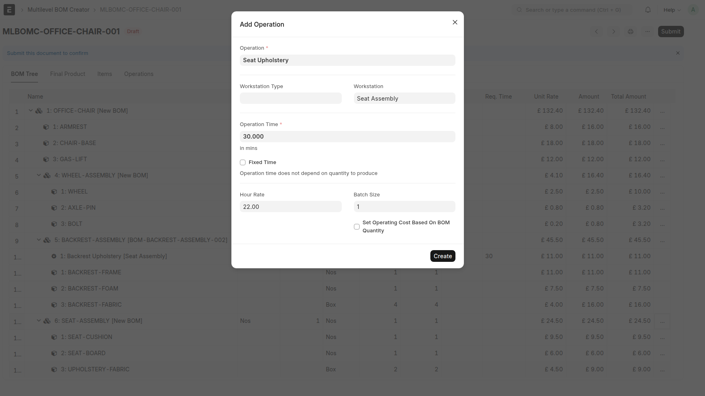
*Caption: Enter the operation details, such as time and workstation context.*

After saving, the operation becomes part of the tree like any other node.

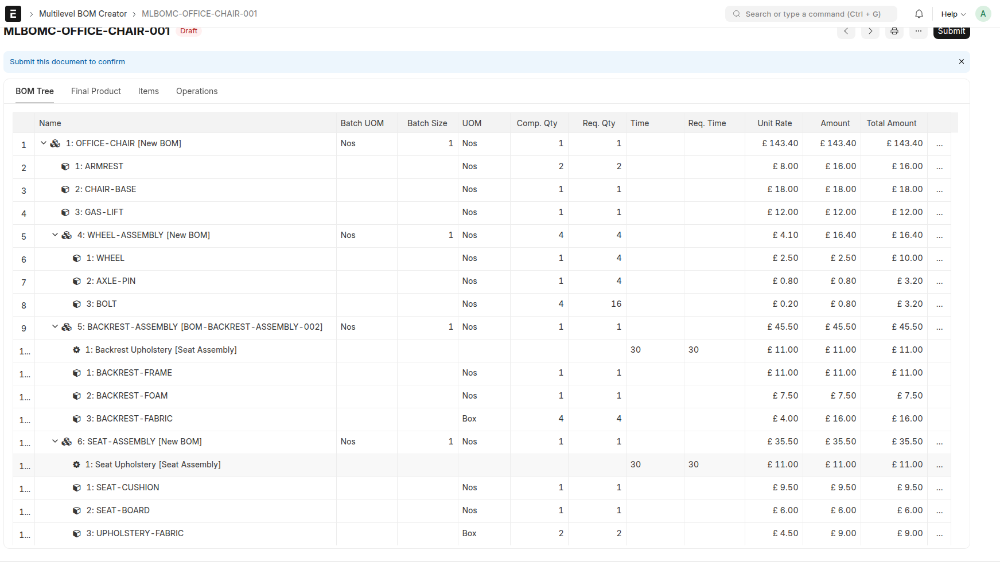
*Caption: The first operation now appears in the BOM tree.*

From there, complete the remaining operations needed in the structure. In our example, that includes the root-level operations `Final Chair Assembly` and `Final Inspection`.

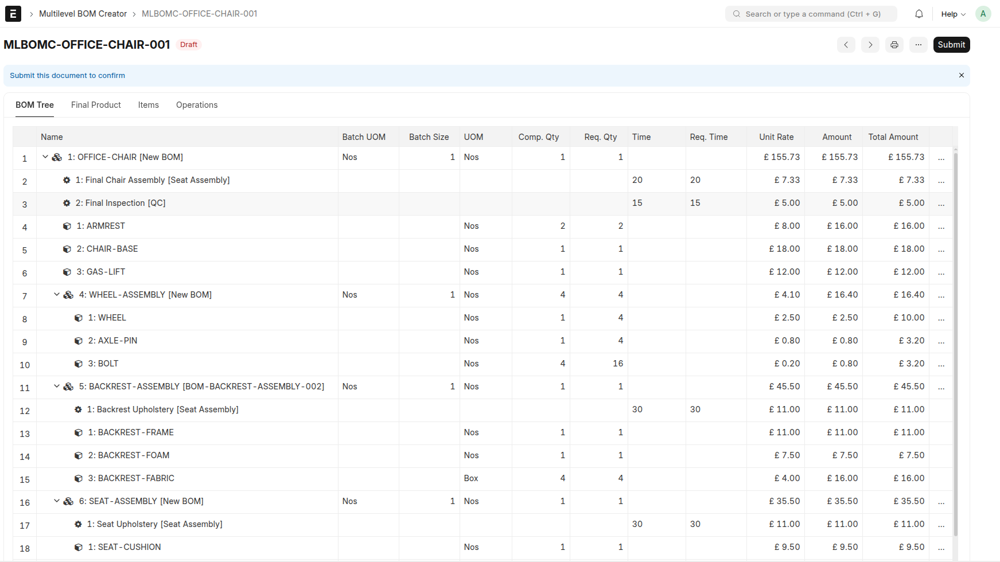
*Caption: After the first operation is added, complete the remaining operations needed in the structure.*

## 6. Create the BOMs

Once the structure is complete, submitting the document creates the missing BOMs from the lower levels upward.

In this example, that means:

- the existing `BACKREST-ASSEMBLY` BOM is reused
- a new BOM is created for `WHEEL-ASSEMBLY`
- a new BOM is created for `SEAT-ASSEMBLY`
- the final BOM is created for `OFFICE-CHAIR`

The result is not just one record. You end up with the full BOM set needed for the product structure you built.

The final Chair BOM created from the Multilevel BOM Creator structure.
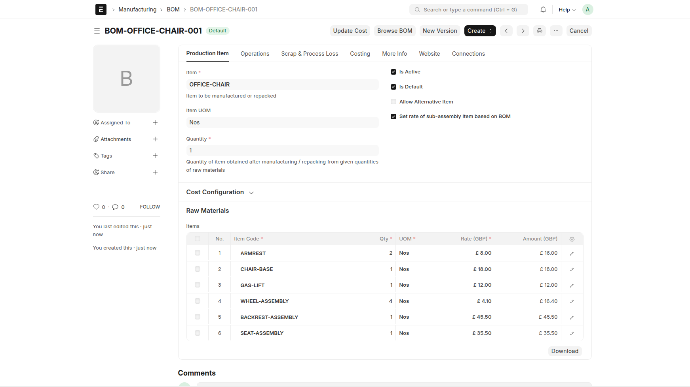
*Caption: The final Chair BOM created from the Multilevel BOM Creator structure.*

The system also creates the BOM for the new `WHEEL-ASSEMBLY` sub-assembly.
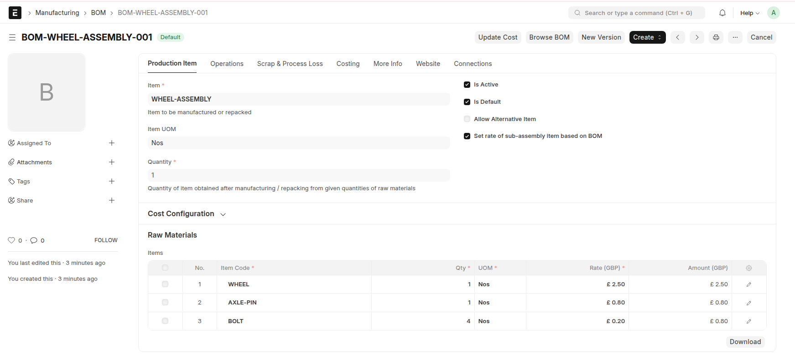
*Caption: The system also creates the BOM for the new `WHEEL-ASSEMBLY` sub-assembly.*

The system also creates the BOM for the new `SEAT-ASSEMBLY` sub-assembly.
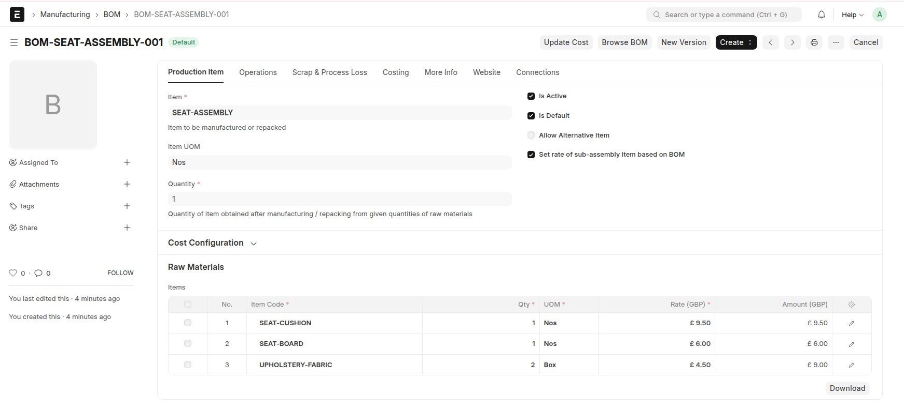
*Caption: The system also creates the BOM for the new `SEAT-ASSEMBLY` sub-assembly.*

## Additional Capabilities

Besides the main tree-building flow, `Multilevel BOM Creator` also supports a few important scenarios that are useful in real manufacturing setups.

### Flexible Cost Calculation Basis

You can change the cost calculation basis from the `Final Product` tab, and the creator recalculates costs according to the selected method.

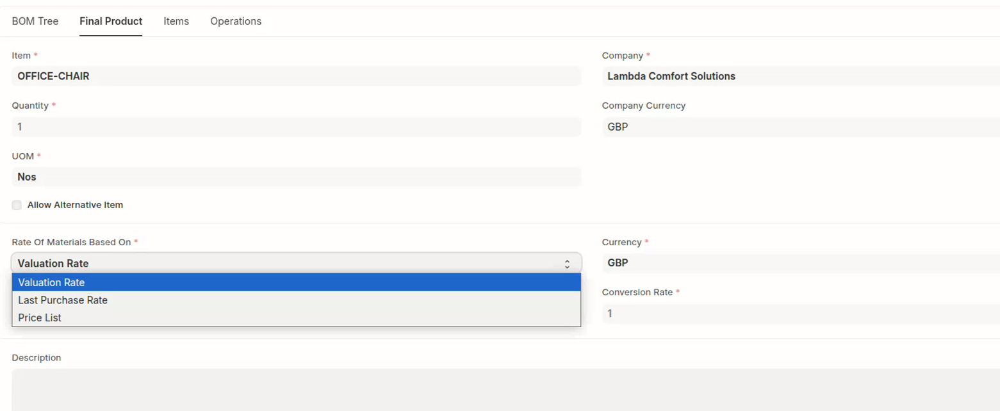
*Caption: Change the cost calculation basis from the `Final Product` tab and review the updated cost values.*

### Different Company Currency and BOM Currency

The creator also supports scenarios where the company currency and the BOM currency are different.

### Different Stock UOM and BOM UOM

While adding items, the creator also supports cases where the item's stock UOM is different from the UOM used inside the BOM being created.

## Key Things to Remember

### New vs Existing Sub-Assembly

Use `Add New Sub-Assembly` when the child BOM does not exist yet and should be created from the current document. Use `Add Existing Sub-Assembly` when the BOM already exists and should simply be reused.

### Projected Rows

Projected rows come from referenced existing BOM structures. They help you see the full structure in one place, but they are read-only.

### Duplicate BOM

If an existing BOM is close to your requirement but not an exact match, first add it as an existing sub-assembly and then use `Duplicate BOM` action. That copies the referenced structure into the current document so the copied immediate children can be adjusted. And in the end it will create new BOM for that sub-assembly reflecting the adjustments you made.

## Closing Note

The main value of `Multilevel BOM Creator` is that it lets a manufacturing user think about the full product structure in one screen. Instead of creating BOMs one by one and mentally stitching them together, you build the whole picture first and let the system generate the missing BOMs after review.
